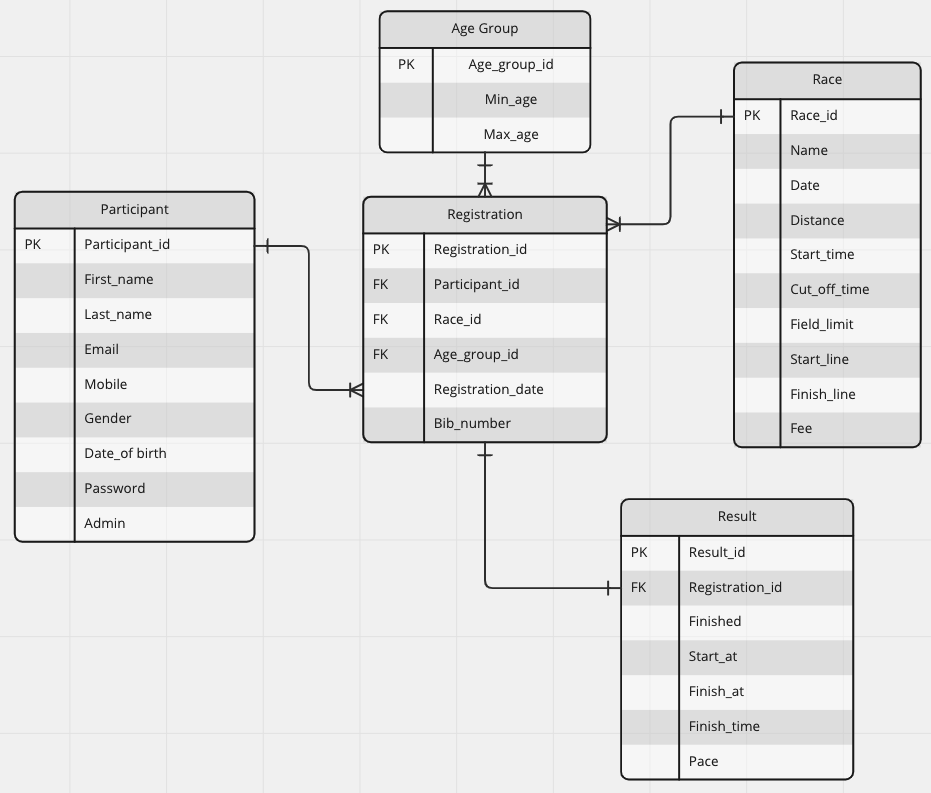

## Problem to be solved and reasons why it needs solving

Every year, thousands of long-distance running festivals take place around the world. As a marathon lover, currently, there is no good way for me to view all of the past running events' data in one place, so an API that stores all the data could be a valuable resource for the public.

The API can provide historical data on previous races, such as participants' information, race information, and overall results based on selected race, age group, and gender. With all these data, this API can act as a tool for the users to analyse their performance compared with world-leading runners, and keep updated with running events happening every day.

With some tweaks, this API can also provide live updates on the status of runners during a race. By cooperating with event organisers, the API can get real-time information about the events and participants, such as weather, runners' live locations, time used, and distance travelled. The audience can utilise the information to track their preferred runners, while coaches can also use it to analyse runners' performance and prepare future coaching plans.

Overall, this API that collects data on long-distance running events could be a useful resource for anyone involved in the sport, including runners, coaches, event organisers and audiences.

## How to install and run the API

Python3 is required for this project. Before getting into the database, the user needs to activate the virtual environment and install the required packages. Make sure you are in the path /src, and run below commands in terminal:

```bash
python3 -m venv .venv
source .venv/bin/activate
pip install requirement.txt
```

This API runs on a database called 'marathon_race', so a database and user must be created first. To create the database, activate PostgreSQL and run the below commands in PostgreSQL:

```sql
CREATE DATABASE marathon_race;
CREATE USER admin WITH PASSWORD '123456';
GRANT ALL PRIVILEGES ON DATABASE marathon_race TO admin;
```

After creating the database and user, exit PostgreSQL and run the below commands in the terminal to initiate and seed the database, and activate the API server.

```bash
flask db init
flask db seed
flask run
```

## Database system advantages and drawbacks

The selected database system is PostgreSQL. The main reasons include:

- A non-relational database is more commonly used to store data that are not convenient to be represented by two-dimensional tables, such as text, pictures, and reports. The structure of two-dimensional tables is closer to the real w world and easy to understand. Also, relational databases are easy to use with common SQL statements. In this API, the data, such as participants' information, race information, and results, are more suitable to be stored in two-dimensional tables, so a relational database system is selected in this case.  <sup>[1]</sup>

- Among all of the relational database systems, PostgreSQL has been selected mainly because PostgreSQL is an open-source, accessible, and robust relational database management system. In addition, it has excellent documentation and community support, making it simple to learn and use.
- PostgreSQL is ACID (Atomicity, Consistency, Isolation, and Durability) compliant, reducing the possibility of data redundancy and inconsistency. <sup>[2]</sup>

- PostgreSQL provides excellent language support, including Python, the primary language used in this API.

- The write-ahead logging standard makes PostgreSQL a stable database with less possibility of data being non-recoverable. 

However, PostgreSQL can also have some drawbacks compared with other DBMSs, such as:

- As a relational database system, PostgreSQL is not as flexible as non-relational databases. In addition, the predefined data structure makes the data storing more limited and data querying less efficient than others.

- Because PostgreSQL is open source and not controlled by a single organisation, it is generally less user-friendly than other DBMSs, such as its graphical user interface.
- The disadvantage that comes with ACID transactions is the slower speed of reading and writing operations. <sup>[3]</sup>

## Key functionalities and benefits of an ORM

- ORM provides mapping to relational databases, which allows developers to manipulate data, such as processing CRUD (create, read, update, and delete) operations in the database by writing codes in their familiar programming languages instead of raw SQL statements. 
- The database access details are hidden under the hoods, making the codes cleaner and development faster.
- Minimum code changes are required when the database changes, making switching between databases fast and easy. <sup>[4]</sup>
- SQL injection is a kind of online attack, using SQL statements, to try to steal confidential information of a program from the backend. An ORM can effectively reduce the risk of SQL injection by significantly eliminating the use of raw SQL queries. <sup>[5]</sup>
- ORM allows sanitising the data using own-defined statements and reduces data security and usability issues. 

## Endpoints

------------------------------------------------------------------------------------------

### Participants

<details>
 <summary><code>POST</code> <code><b>/participants/register</b></code> <code>(to register new user and get access token)</code></summary>

#### Required data

The user needs to send the below data in JSON format.

| Name          | Required | Data type | Description                                                          |
|---------------|----------|-----------|----------------------------------------------------------------------|
| first_name    | required | string    | must only contain alphabet letters                                   |
| last_name     | required | string    | must only contain alphabet letters                                   |
| email         | required | string    | must be a valid email address                                        |
| mobile        | required | string    | must be a valid Australian mobile number starting with 04              |
| password      | required | string    | must be at least 8 letters long and have at least 1 uppercase letter |
| date_of_birth | required | string    | must be in a format of yyyy-MM-dd                                    |
| gender        | required | string    | must be in ['male', 'female']                                        |

#### Example payload

```json
{
    "first_name": "Ji",
    "last_name": "Li",
    "email": "test10@test.com",
    "mobile": "0431754134",
    "password": "12345789A",
    "date_of_birth": "2022-11-05",
    "gender": "male"
}
```

#### Responses

- Error: participant already registered. It happens when the user registers with an existing email or mobile number

```html
<title>400 Bad Request</title>
<h1>Bad Request</h1>
<p>Participant already registered</p>
```

- Error: missing information

```html
<title>400 Bad Request</title>
<h1>Bad Request</h1>
<p>Please provide mobile, password</p>
```

- Error: invalid format. Below is an example response when the password doesn't meet the requirement

```html
<title>400 Bad Request</title>
<h1>Bad Request</h1>
<p>The password must be at least 8 letters long and have at least 1 uppercase letter</p>
```

- Success: returns email, mobile and access token in a JSON format

```json
{
    "msg": "Registered successfully",
    "id": 2,
    "email": "test2@test.com",
    "mobile": "0431754193",
    "token": "eyJhbGciOiJIUzI1NiIsInR5cCI6IkpXVCJ9.eyJmcmVzaCI6ZmFsc2UsImlhdCI6MTY3ODg3MTMzNywianRpIjoiYTViNjE"
}
```

</details>

<details>
 <summary><code>POST</code> <code><b>/participants/login</b></code> <code>(for existing user to login and get access token)</code></summary>

#### Required data

The user is required to login with either email or mobile. If both are provided, the API will look for existing user with email first, if none, then it will search with mobile.

| Name     | Required | Data type | Description                                                  |
| -------- | -------- | --------- | ------------------------------------------------------------ |
| email    | optional | string    | must be a valid email address                                |
| mobile   | optional | string    | must be a valid Australian mobile number starting with 04    |
| password | required | string    | must be at least 8 letters long and have at least 1 uppercase letter |

#### Example payload

```json
{
    "email": "test@test.com",
    "password": "Password12345678"
}
```
```json
{
    "mobile": "0412345678",
    "password": "Password12345678"
}
```

#### Responses

- Error: mobile and email is not provided

```html
<title>400 Bad Request</title>
<h1>Bad Request</h1>
<p>Please provide email address or mobile to login</p>
```

- Error: password is not provided

```html
<title>400 Bad Request</title>
<h1>Bad Request</h1>
<p>Please provide password</p>
```

- Error: user not found

```html
<title>404 Not Found</title>
<h1>Not Found</h1>
<p>User not found</p>
```

- Error: incorrect password

```html
<title>401 Unauthorized</title>
<h1>Unauthorized</h1>
<p>Incorrect password</p>
```

- Success: returns email, mobile and access token in a JSON format

```json
{
    "msg": "Login successfully",
    "id" : 2,
    "email": "test2@test.com",
    "mobile": "0431754193",
    "token": "eyJhbGciOiJIUzI1NiIsInR5cCI6IkpXVCJ9.eyJmcmVzaCI6ZmFsc2UsImlhdCI6MTY3ODg3MTMzNywianRpIjoiYTViNjE"
}
```
</details>

<details>
 <summary><code>GET</code> <code><b>/participants/all</b></code> <code>(for admin to check all participants)</code></summary>

#### Required data

Admin user only. JWT authentication is implemented. When the user registers or logs in, they will get a bearer token. To access this route, the admin user needs to send the bearer token with the request. Non-admin user will be rejected.

#### Example payload

None

#### Responses

- Error: invalid user (non-admin user)

```html
<title>401 Unauthorized</title>
<h1>Unauthorized</h1>
<p>Invalid User</p>
```

- Success: return all participants' details

```json
[
    {
        "id": 1,
        "first_name": "Eliud",
        "last_name": "Kipchoge",
        "email": "test@test.com",
        "mobile": "0412345678",
        "date_of_birth": "1984-11-05",
        "gender": "male"
    },
    {
        "id": 2,
        "first_name": "Ji",
        "last_name": "Li",
        "email": "test10@test.com",
        "mobile": "0431754134",
        "date_of_birth": "2022-11-05",
        "gender": "male"
    }
]
```

</details>

<details>
 <summary><code>GET</code> <code><b>/participants/{int:participant_id}</b></code> <code>(for existing user to access personal details)</code></summary>

#### Required data

JWT access token required. Non-admin users can only access their own personal details, while admin users can access all user's details.

#### Example payload

None

#### Responses

- Error: invalid user (when a non-admin user is trying to access other user's details)

```html
<title>401 Unauthorized</title>
<h1>Unauthorized</h1>
<p>Invalid User</p>
```

- Success: return participant's details

```json
{
    "id": 1,
    "first_name": "Eliud",
    "last_name": "Kipchoge",
    "email": "test@test.com",
    "mobile": "1234567890",
    "date_of_birth": "1984-11-05",
    "gender": "male"
}
```

</details>

<details>
 <summary><code>PUT</code> <code><b>/participants/{int:participant_id}</b></code> <code>(for user to update personal details)</code></summary>

#### Required data

JWT access token required. Non-admin users can only update their own personal details, while admin users can update all user's details.

To update any field of the personal details, the user needs to send the updated data in the body of the request in a JSON format.

| Name          | Required | Data type | Description                                                  |
| ------------- | -------- | --------- | ------------------------------------------------------------ |
| first_name    | optional | string    | must only contain alphabet letters                           |
| last_name     | optional | string    | must only contain alphabet letters                           |
| email         | optional | string    | must be a valid email address                                |
| mobile        | optional | string    | must be a valid Australian mobile number starting with 04    |
| password      | optional | string    | must be at least 8 letters long and have at least 1 uppercase letter |
| date_of_birth | optional | string    | must be in a format of yyyy-MM-dd                            |
| gender        | optional | string    | must be in ['male', 'female']                                |


#### Example payload

```json
    {
        "first_name": "Ji",
        "email": "test10@test.com",
    }
```

#### Responses

- Error: user not found with specific id

```html
<title>404 Not Found</title>
<h1>Not Found</h1>
<p>Participant not found</p>
```

- Error: invalid user (when a non-admin user is trying to update other user's details)

```html
<title>401 Unauthorized</title>
<h1>Unauthorized</h1>
<p>Invalid User</p>
```

- Success: return successful message and updated details

```json
{
    "msg": "Updated successfully",
    "Updated": {
        "id": 2,
        "first_name": "Ji",
        "last_name": "Li",
        "email": "test10@test.com",
        "mobile": "0431754134",
        "date_of_birth": "2022-11-05",
        "gender": "male"
    }
}
```

</details>

<details>
 <summary><code>DELETE</code> <code><b>/participants/{int:participant_id}</b></code> <code>(for admin user to delete a specific participant)</code></summary>

#### Required data

Admin user only. JWT access token required.

#### Example payload

None

#### Responses

- Error: user not found with specific id

```html
<title>404 Not Found</title>
<h1>Not Found</h1>
<p>Participant not found</p>
```

- Error: invalid user (when a non-admin user is trying to delete)

```html
<title>401 Unauthorized</title>
<h1>Unauthorized</h1>
<p>Invalid User</p>
```

- Error: when there is registrations linked with the participant, need to delete the registrations first

```html
<title>400 Bad Request</title>
<h1>Bad Request</h1>
<p>Please delete the registrations linked with this participant before deleting this participant</p>
```

- Success: return delete successful message

```json
{
    "msg": "Participant deleted successfully",
    "result": {
        "id": 1,
        "first_name": "Eliud",
        "last_name": "Kipchoge",
        "email": "test@test.com",
        "mobile": "0412345678",
        "date_of_birth": "1984-11-05",
        "gender": "male"
    }
}
```

</details>

<details>
 <summary><code>GET</code> <code><b>/participants/{int:participant_id}/registrations</b></code> <code>(for user to check their existing registrations)</code></summary>

#### Required data

JWT access token required. Non-admin users can only check their own registrations, while admin users can access all participants' registrations.

#### Example payload

None

#### Responses

- Error: user not found with specific id

```html
<title>404 Not Found</title>
<h1>Not Found</h1>
<p>Participant not found</p>
```

- Error: invalid user (when a non-admin user is trying to update other user's details)

```html
<title>401 Unauthorized</title>
<h1>Unauthorized</h1>
<p>Invalid User</p>
```

- Success: return all registrations under the participant

```json
{
    "participant": {
        "first_name": "Eliud",
        "last_name": "Kipchoge"
    },
    "registrations": [
        {
            "race": "Berlin Marathon",
            "age_group": {
                "min_age": 20,
                "max_age": 39
            },
            "gender_group": "male",
            "registration_date": "2022-09-25",
            "bib_number": "A1234"
        }
    ]
}
```

</details>

------------------------------------------------------------------------------------------

### Age groups

<details>
 <summary><code>GET</code> <code><b>/age_groups</b></code> <code>(to view all age groups)</code></summary>

#### Required data

None

#### Example payload

None

#### Responses

- Success: returns all age groups, example response:

```json
[
    {
        "id": 1,
        "min_age": 0,
        "max_age": 17
    },
    {
        "id": 2,
        "min_age": 18,
        "max_age": 19
    }
]
```

</details>

------------------------------------------------------------------------------------------

### Races

<details>
 <summary><code>GET</code> <code><b>/races</b></code> <code>(to view all races)</code></summary>

#### Required data

None

#### Example payload

None

#### Responses

- Success: returns all races, example response:

```json
[
    {
        "id": 1,
        "name": "Melbourne Marathon",
        "distance": "2.13",
        "date": "2022-09-25",
        "start_time": "07:00:00",
        "cut_off_time": "14:00:00",
        "field_limit": 9000,
        "start_line": "Batman Avenue (150m North of Rod Laver Arena)",
        "finish_line": "Melbourne Cricket Ground (MCG)",
        "fee": "160.01"
    }
]
```

</details>

<details>
 <summary><code>GET</code> <code><b>/races/{int:race_id}</b></code> <code>(to view a single race)</code></summary>

#### Required data

None

#### Example payload

None

#### Responses

- Success: returns single race corresponding to the race_id

```json
[
    {
        "id": 1,
        "name": "Melbourne Marathon",
        "distance": "2.13",
        "date": "2022-09-25",
        "start_time": "07:00:00",
        "cut_off_time": "14:00:00",
        "field_limit": 9000,
        "start_line": "Batman Avenue (150m North of Rod Laver Arena)",
        "finish_line": "Melbourne Cricket Ground (MCG)",
        "fee": "160.01"
    }
]
```

</details>

<details>
 <summary><code>POST</code> <code><b>/races</b></code> <code>(to add a race, admin only)</code></summary>

#### Required data

JWT access token required. Admin user only. Below is the required data.

| Name         | Required | Data type | Description                                                |
|--------------|----------|-----------|------------------------------------------------------------|
| name         | required | string    | Name of the race                                           |
| distance     | required | float     | must be a number larger than 0                             |
| date         | required | string    | must be in a format of yyyy-MM-dd                          |
| start_time   | required | string    | must be in a format of HH:MM:SS                            |
| cut_off_time | required | string    | must be in a format of HH:MM:SS and larger than start_time |
| field_limit  | required | int       | must be a int larger than 0                                |
| start_line   | required | string    | start point of the race                                    |
| finish_line  | required | string    | end point of the race                                      |
| fee          | required | float     | must be a number larger than 0                             |

#### Example payload

```json
{
    "name": "Melbourne Marathon",
    "distance": 21.1,
    "date": "2022-09-25",
    "start_time": "07:00:00",
    "cut_off_time": "12:00:00",
    "field_limit": 6000,
    "start_line": "Batman Avenue (150m North of Rod Laver Arena)",
    "finish_line": "Melbourne Cricket Ground (MCG)",
    "fee": 160.01
}
```

#### Responses

- Error: required field missing

```html
<title>400 Bad Request</title>
<h1>Bad Request</h1>
<p>Please provide finish_line, fee</p>
```

- Error: incorrect format of provided field, example:

```html
<title>400 Bad Request</title>
<h1>Bad Request</h1>
<p>Cut off time cannot be earlier than start time</p>
```

- Error: race already exists. The combination of name and date must be unique.

```html
<title>400 Bad Request</title>
<h1>Bad Request</h1>
<p>Race already exists!</p>
```

- Error: non-admin user

```html
<title>401 Unauthorized</title>
<h1>Unauthorized</h1>
<p>Invalid User</p>
```

- Success: returns successful message with race detail

```json
{
    "msg": "Race added successfully",
    "race": {
        "id": 10,
        "name": "Melbourne Marathon",
        "distance": 21.1,
        "date": "2022-09-25",
        "start_time": "07:00:00",
        "cut_off_time": "12:00:00",
        "field_limit": 6000,
        "start_line": "Batman Avenue (150m North of Rod Laver Arena)",
        "finish_line": "Melbourne Cricket Ground (MCG)",
        "fee": 160.01
    }
}
```

</details>

<details>
 <summary><code>PUT</code> <code><b>/races/{int:race_id}</b></code> <code>(to update a race, admin only)</code></summary>

#### Required data

JWT access token required. Admin user only. User needs to send the updated field in the body.

| Name         | Required | Data type | Description                                                |
|--------------|----------|-----------|------------------------------------------------------------|
| name         | optional | string    | Name of the race                                           |
| distance     | optional | float     | must be a number larger than 0                             |
| date         | optional | string    | must be in a format of yyyy-MM-dd                          |
| start_time   | optional | string    | must be in a format of HH:MM:SS                            |
| cut_off_time | optional | string    | must be in a format of HH:MM:SS and larger than start_time |
| field_limit  | optional | int       | must be a int larger than 0                                |
| start_line   | optional | string    | start point of the race                                    |
| finish_line  | optional | string    | end point of the race                                      |
| fee          | optional | float     | must be a number larger than 0                             |

#### Example payload

```json
{
    "name": "Melbourne Marathon",
    "distance": 21.1,
    "date": "2022-09-25",
    "start_time": "07:00:00",
    "cut_off_time": "12:00:00",
    "field_limit": 6000,
    "start_line": "Batman Avenue (150m North of Rod Laver Arena)",
    "finish_line": "Melbourne Cricket Ground (MCG)",
    "fee": 160.01
}
```

#### Responses

- Error: incorrect format of provided field, example:

```html
<title>400 Bad Request</title>
<h1>Bad Request</h1>
<p>Cut off time cannot be earlier than start time</p>
```

- Error: race already exists. The combination of name and date must be unique.

```html
<title>400 Bad Request</title>
<h1>Bad Request</h1>
<p>Race already exists!</p>
```

- Error: non-admin user

```html
<title>401 Unauthorized</title>
<h1>Unauthorized</h1>
<p>Invalid User</p>
```

- Success: returns update successful message with race detail

```json
{
    "msg": "Updated successfully",
    "race": {
        "id": 10,
        "name": "Melbourne Marathon",
        "distance": 21.1,
        "date": "2022-09-25",
        "start_time": "07:00:00",
        "cut_off_time": "12:00:00",
        "field_limit": 6000,
        "start_line": "Batman Avenue (150m North of Rod Laver Arena)",
        "finish_line": "Melbourne Cricket Ground (MCG)",
        "fee": 160.01
    }
}
```

</details>

</details>

<details>
 <summary><code>DELETE</code> <code><b>/races/{int:race_id}</b></code> <code>(to delete a race, admin only)</code></summary>

#### Required data

JWT access token required. Admin user only. 

#### Example payload

None

#### Responses

- Error: non-admin user

```html
<title>401 Unauthorized</title>
<h1>Unauthorized</h1>
<p>Invalid User</p>
```

- Error: race not found with specific id

```html
<title>404 Not Found</title>
<h1>Not Found</h1>
<p>Race not found</p>
```
- Error:  when there are registrations linked with the race, need to delete the registrations first
```html
<title>400 Bad Request</title>
<h1>Bad Request</h1>
<p>Please delete the registrations linked with this race before deleting this race</p>
```

- Success: returns delete successful message with race detail

```json
{
    "msg": "Race deleted successfully",
    "race": {
        "id": 1,
        "name": "Berlin Marathon",
        "distance": "2.13",
        "date": "2022-09-25",
        "start_time": "07:00:00",
        "cut_off_time": "09:00:00",
        "field_limit": 9000,
        "start_line": "Batman Avenue (150m North of Rod Laver Arena)",
        "finish_line": "Melbourne Cricket Ground (MCG)",
        "fee": "160.01"
    }
}
```

</details>

------------------------------------------------------------------------------------------

### Registrations

<details>
 <summary><code>GET</code> <code><b>/registrations</b></code> <code>(to view all registrations, admin only)</code></summary>

#### Required data

JWT access token required. Admin user only.

#### Example payload

None

#### Responses

- Error: non-admin user

```html
<title>401 Unauthorized</title>
<h1>Unauthorized</h1>
<p>Invalid User</p>
```

- Success: returns all existing registrations

```json
[
    {
        "participant": {
            "first_name": "Eliud",
            "last_name": "Kipchoge"
        },
        "race": "Berlin Marathon",
        "age_group": {
            "min_age": 20,
            "max_age": 39
        },
        "gender_group": "male",
        "registration_date": "2022-09-25",
        "bib_number": "A1234"
    }
]
```

</details>

<details>
 <summary><code>POST</code> <code><b>/registrations</b></code> <code>(to add a registration, admin only)</code></summary>

#### Required data

JWT access token required. Admin user only. User needs to input all required fields below. The program will automatically determine the age group based on participant's date_of_birth, so it shouldn't be passed here.

| Name             | Required | Data type | Description                                                |
|------------------|----------|-----------|------------------------------------------------------------|
| participant_id   | required | int       | must be the id of an existing participant                  |
| race_id          | required | int       | must be the id of an existing race                         |
| registration_date| required | string    | must be in a format of yyyy-MM-dd                          |
| bib_number       | required | string    | unique combination of alphabet letters and numbers for each registration|

#### Example payload

```json
{
    "participant_id": 1,
    "race_id": 1,
    "registration_date": "2022-09-25",
    "bib_number": "A12345"
}
```

#### Responses

- Error: non-admin user

```html
<title>401 Unauthorized</title>
<h1>Unauthorized</h1>
<p>Invalid User</p>
```

- Error: participant already registered

```html
<title>400 Bad Request</title>
<h1>Bad Request</h1>
<p>Participant already registered this race</p>
```

- Error: bib number exists
```html
<title>400 Bad Request</title>
<h1>Bad Request</h1>
<p>Bib number already exists under this race</p>
```

- Error: participant not found
```html
<title>404 Not Found</title>
<h1>Not Found</h1>
<p>Participant not found</p>
```

- Error: race not found
```html
<title>404 Not Found</title>
<h1>Not Found</h1>
<p>Race not found</p>
```

- Success: returns successful message and registration details

```json
{
    "msg": "Registration added successfully",
    "registration": {
        "id": 8,
        "participant": {
            "first_name": "Ji",
            "last_name": "Li",
            "gender": "male"
        },
        "race": "Berlin Marathon",
        "age_group": {
            "min_age": 0,
            "max_age": 17
        },
        "registration_date": "2022-09-25",
        "bib_number": "A123456"
    }
}
```

</details>

<details>
 <summary><code>PUT</code> <code><b>/registrations/{int:registration_id}</b></code> <code>(to update a registration, admin only)</code></summary>

#### Required data

JWT access token required. Admin user only. User can pass any updated fields in the body.

| Name             | Required | Data type | Description                                                |
|------------------|----------|-----------|------------------------------------------------------------|
| participant_id   | optional | int       | must be the id of an existing participant                  |
| race_id          | optional | int       | must be the id of an existing race                         |
| registration_date| optional | string    | must be in a format of yyyy-MM-dd                          |
| bib_number       | optional | string    | unique combination of alphabet letters and numbers for each registration|

#### Example payload

```json
{
    "participant_id": 1,
    "race_id": 1,
    "registration_date": "2022-09-25",
    "bib_number": "A12345"
}
```

#### Responses

- Error: non-admin user

```html
<title>401 Unauthorized</title>
<h1>Unauthorized</h1>
<p>Invalid User</p>
```

- Error: participant already registered

```html
<title>400 Bad Request</title>
<h1>Bad Request</h1>
<p>Participant already registered this race</p>
```

- Error: bib number exists
```html
<title>400 Bad Request</title>
<h1>Bad Request</h1>
<p>Bib number already exists under this race</p>
```

- Error: participant not found
```html
<title>404 Not Found</title>
<h1>Not Found</h1>
<p>Participant not found</p>
```

- Error: race not found
```html
<title>404 Not Found</title>
<h1>Not Found</h1>
<p>Race not found</p>
```

- Success: returns successful message and registration details

```json
{
    "msg": "Updated successfully",
    "registration": {
        "id": 8,
        "participant": {
            "first_name": "Ji",
            "last_name": "Li",
            "gender": "male"
        },
        "race": "Berlin Marathon",
        "age_group": {
            "min_age": 0,
            "max_age": 17
        },
        "registration_date": "2022-09-25",
        "bib_number": "A12346"
    }
}
```

</details>

<details>
 <summary><code>DELETE</code> <code><b>/registrations/{int:registration_id}</b></code> <code>(to delete a registration, admin only)</code></summary>

#### Required data

JWT access token required. Admin user only.

#### Example payload

None

#### Responses

- Error: non-admin user

```html
<title>401 Unauthorized</title>
<h1>Unauthorized</h1>
<p>Invalid User</p>
```

- Error: registration not found

```html
<title>404 Not Found</title>
<h1>Not Found</h1>
<p>Registration not found</p>
```

- Error: when there is a result linked with the registration, need to delete the result first
```html
<title>400 Bad Request</title>
<h1>Bad Request</h1>
<p>Please delete the result linked with this registration before deleting this registration</p>
```

- Success: returns successful message and registration details

```json
{
    "msg": "Registration deleted successfully",
    "result": {
        "id": 1,
        "participant": {
            "first_name": "Eliud",
            "last_name": "Kipchoge",
            "gender": "male"
        },
        "race": "Berlin Marathon",
        "age_group": {
            "min_age": 20,
            "max_age": 39
        },
        "registration_date": "2022-09-25",
        "bib_number": "A1234"
    }
}
```

</details>

------------------------------------------------------------------------------------------

### Results

<details>
 <summary><code>GET</code> <code><b>/results</b></code> <code>(to view results based on race, age group and gender)</code></summary>

#### Required data

Query parameters are utilised in this route. User can pass race_id, age_group_id and gender to view results based on these criteria. If any of these parameters are not passed, it will be considered to view all results under the category,

| Name             | Required | Data type | Description                                                |
|------------------|----------|-----------|------------------------------------------------------------|
| race_id          | optional | int       | must be the id of an existing race                         |
| age_group_id     | optional | int       | must be the id of an existing age_group                    |
| gender           | optional | string    | must be in ['male', 'female']                              |

For example, the query strings can be like: [/results/?race_id=1&age_group_id=1&gender=male](/results/?race_id=1&age_group_id=1&gender=male)

#### Example payload

None

#### Responses

- Error: race/age_group not found

```html
<title>404 Not Found</title>
<h1>Not Found</h1>
<p>Race not found</p>
```

- Success: returns all existing results in a ascending order of finish_time

```json
{
    "race": "Berlin Marathon",
    "age_group": {
        "min_age": "All",
        "max_age": "All"
    },
    "gender": "male",
    "results": [
        {
            "place": 1,
            "first_name": "Eliud",
            "last_name": "Kipchoge",
            "finished": true,
            "start_at": "07:00:00",
            "finish_at": "09:00:00",
            "finish_time": "02:00:00",
            "pace": "00:02:50"
        },
        {
            "place": 2,
            "first_name": "Ji",
            "last_name": "Li",
            "finished": true,
            "start_at": "07:00:00",
            "finish_at": "11:00:00",
            "finish_time": "04:00:00",
            "pace": "00:05:41"
        }
    ]
}
```

</details>

<details>
 <summary><code>POST</code> <code><b>/results</b></code> <code>(to add a result, admin only)</code></summary>

#### Required data

JWT access token required, and admin user only. Users are required to pass the below data in the request body. The finish time and pace will be calculated automatically by the program, so they are not required.

| Name             | Required | Data type | Description                                                |
|------------------|----------|-----------|------------------------------------------------------------|
| registration_id  | required | int       | must be the id of an existing registration                 |
| finished         | required | boolean   | must be either true or false                               |
| start_at         | required | string    | must be in the format of '%H:%M:%S                         |
| finish_at        | required | string    | must be in the format of '%H:%M:%S                         |

#### Example payload

```json
{
    "registration_id": 9,
    "finished": true,
    "start_at": "07:00:00",
    "finish_at": "9:00:00"
}
```

#### Responses

- Error: non-admin user

```html
<title>401 Unauthorized</title>
<h1>Unauthorized</h1>
<p>Invalid User</p>
```

- Error: registration not found

```html
<title>404 Not Found</title>
<h1>Not Found</h1>
<p>Registration not found</p>
```

- Error: registration already has a result

```html
<title>400 Bad Request</title>
<h1>Bad Request</h1>
<p>Result with same registration id already exists</p>
```

- Success: returns successful message and result details

```json
{
    "description": "Added successfully",
    "result": {
        "participant": {
            "first_name": "Eliud",
            "last_name": "Kipchoge"
        },
        "id": 13,
        "registration_id": 9,
        "finished": true,
        "start_at": "07:00:00",
        "finish_at": "09:00:00",
        "finish_time": "02:00:00",
        "pace": "00:02:50"
    }
}
```

</details>

<details>
 <summary><code>PUT</code> <code><b>/results/{int:result_id}</b></code> <code>(to update a result, admin only)</code></summary>

#### Required data

JWT access token required, and admin user only. Users can pass any updated fields in the request body.

| Name             | Required | Data type | Description                                                |
|------------------|----------|-----------|------------------------------------------------------------|
| registration_id  | optional | int       | must be the id of an existing registration                 |
| finished         | optional | boolean   | must be either true or false                               |
| start_at         | optional | string    | must be in the format of '%H:%M:%S                         |
| finish_at        | optional | string    | must be in the format of '%H:%M:%S                         |

#### Example payload

```json
{
    "registration_id": 9,
    "finished": true,
    "start_at": "07:00:00",
    "finish_at": "9:00:00"
}
```

#### Responses

- Error: non-admin user

```html
<title>401 Unauthorized</title>
<h1>Unauthorized</h1>
<p>Invalid User</p>
```

- Error: registration not found

```html
<title>404 Not Found</title>
<h1>Not Found</h1>
<p>Registration not found</p>
```

- Error: registration already has a result

```html
<title>400 Bad Request</title>
<h1>Bad Request</h1>
<p>Result with same registration id already exists</p>
```

- Success: returns successful message and result details

```json
{
    "msg": "Updated successfully",
    "result": {
        "participant": {
            "first_name": "Eliud",
            "last_name": "Kipchoge"
        },
        "id": 10,
        "registration_id": 9,
        "finished": true,
        "start_at": "07:00:00",
        "finish_at": "10:00:00",
        "finish_time": "3:00:00",
        "pace": "00:04:15"
    }
}
```

</details>


<details>
 <summary><code>DELETE</code> <code><b>/results/{int:result_id}</b></code> <code>(to delete a result, admin only)</code></summary>

#### Required data

JWT access token required, and admin user only.

#### Example payload

None

#### Responses

- Error: non-admin user

```html
<title>401 Unauthorized</title>
<h1>Unauthorized</h1>
<p>Invalid User</p>
```

- Error: result not found

```html
<title>404 Not Found</title>
<h1>Not Found</h1>
<p>Result not found</p>
```

- Success: returns successful message and result details

```json
{
    "msg": "Result deleted successfully",
    "result": {
        "participant": {
            "first_name": "Eliud",
            "last_name": "Kipchoge"
        },
        "id": 13,
        "registration_id": 9,
        "finished": true,
        "start_at": "07:00:00",
        "finish_at": "09:00:00",
        "finish_time": "02:00:00",
        "pace": "00:02:50"
    }
}
```

</details>

## ERD



## Detail any third party services that your *app* will use

- [Flask](https://flask.palletsprojects.com/en/2.2.x/): As the framework to develop RESTful API. It provides methods to define routes, handle HTTP requests and responses, and manage application configurations.
- [Flask-SQLAlchemy](https://flask-sqlalchemy.palletsprojects.com/en/3.0.x/): Makes SQLAlchemy available for Flask. SQLAlchemy is an ORM that enables developers to process CRUD operations to the database without writing raw SQL statements.
- [Flask-Bcrypt](https://flask-bcrypt.readthedocs.io/en/1.0.1/): A Flask extension that provides bcrypt hashing utilities for flask applications. In this project, the password of the participants has been hashed using method ```generate_password_hash()```, and ```check_password_hash()``` is used to check if the login details are correct.
- [Flask-JWT-Extended](https://flask-jwt-extended.readthedocs.io/en/stable/): For authentication of the API. For example, ```create_access_token()```generates JSON Web Tokens. ```jwt_required()``` acts as a decorator to the routes which require login, and  ```get_jwt_identity()``` to get the identity of a JWT.
- [Flask-Marshallow](https://flask-marshmallow.readthedocs.io/en/latest/): A Flask extension to allow object deserialisations and serialisations, so the result can be output as JSON format.
- [psycopg2](https://pypi.org/project/psycopg2/): For database connection between SQLAlchemy and PostgreSQL.
- [phonenumbers](https://pypi.org/project/phonenumbers/): For phone number validations. ```parse()``` is the method to create a ```PhoneNumber``` object and `is_valid_number()` is used to validate whether the phone number is valid.
- [password_strength](https://pypi.org/project/password-strength/): The requirement of password strength in this project is at least 8 letters long and at least 1 uppercase letter. This is implemented with the help of the method `PasswordPolicy.from_names()` in this package.
- [email-validator](https://pypi.org/project/email-validator/): The method `validate_email` from this package has been used to validate the email format of user input.

## Describe your projects *models* in terms of the relationships they have with each other

#### Participants to Registrations

The relationship between participants and registrations is a one-to-many relationship. To achieve this relationship, there should be a foreign key 'participant_id' in the registrations table:

```python
# participant_id as a foreign key in the registration table
participant_id = db.Column(db.Integer(), db.ForeignKey('participants.id'), nullable=False)
```

Also, to establish a bidirectional relationship, a ```db.relationship``` is declared in the participants model:

```python
registrations = db.relationship('Registration', backref = 'participant')
```

#### Races to Registrations

Similar to above, the relationship between races and registrations is also one-to-many. So a foreign key of 'race_id' is added in the registration table:

```python
# add race_id as foreign key in registration table
race_id = db.Column(db.Integer(), db.ForeignKey('races.id'), nullable=False)
```

And a ```db.relationship``` is declared in the races model:

```python
registrations = db.relationship('Registration',backref = 'race')
```

#### Age_groups to Registrations

Also similar to above, it's a one-to-many relationship, and 'age_group_id' is added as a foreign key in the registrations table.

```python
# add age_group_id as foreign key in the registration table
age_group_id = db.Column(db.Integer(), db.ForeignKey('age_groups.id'), nullable=False)
```

And the relationship is declared in the age_groups model as below.

```python
registrations = db.relationship('Registration', backref = 'age_group')
```

#### Registrations to Results

It's a one-to-one relationship between registrations and results. To declare this relationship, a 'registration_id' has been added as a foerign key in the results table. ```unique = True``` is added because one registration can only correspond to one result.

```python
# add registration_id as a foreign key in the result table
registration_id = db.Column(db.Integer(), db.ForeignKey('registrations.id'), nullable=False, unique=True)
```

And to make sure it's a one-to-one relationship, the below codes are added to the registrations model:

```python
  result = db.relationship(
      'Result',
      backref = 'registration',
      # make sure it's one-to-one relationship
      uselist = False
  )
```

In this case, the statement `uselist = False` tells SQLAlchemy to load the connection as a scalar rather than a list, indicating this is a one-to-one relationship instead of one-to-many.

## Discuss the database relations to be implemented in your application

The tables include:

1. Participants: contains the participants who have registered in the application. Gender and date of birth are required, because it will help query the race results based on different genders and age groups, which is a popular demand by the users in marathon races.
2. Age_groups: contains the min and max age of each age group. This mainly helps the query of race results based on age groups.
3. Races: contains the details of each race, such as name, date, location, and distance. 
4. Registrations: contains the registration details corresponding to each participant and race. 
5. Results: the result of each registration.

The relations between each table:

1. Participants to Races: many-to-many relationship. One participant can register for multiple races, and one race can have up to thousands of participants, so a new table is required in this case, which is the registration table.
2. Participants to Registrations: one-to-many relationship. One participant can sign up for none, one, or multiple races during different dates, so this is a one-to-many relationship.
3. Age_groups to Registrations: one-to-many relationship. One registration can only be linked with one age group, but one age group can have many registrations. 
4. Races to Registrations: one-to-many relationship. Similar to above, there can be many registrations in a single race, and one registration is only linked to one race.
5. Registrations to Result: one-to-one relationship. They are exclusive to each other. These two tables are not combined because the result table will be updated after the race has begun and registration has stopped. By separating them, updating the result table will be easier and faster, since it's a smaller table. The separation also makes it more quickly when querying for different data, for example, when the user only asks for the details of registrations. 

## Describe the way tasks are allocated and tracked in your project

The project management is mainly divided into 3 parts:

#### Planning & Design

In this section, the idea of the API has been developed, the ERD is finished, and most of the API endpoints are defined.

#### Implementation & Testing

The coding work began in this project stage, including setting up the environment, initialising the database, and implementing routes. The manual testing tasks were conducted together with the development process to ensure all endpoints are working correctly as expected.

#### Documentation

The final stage is to document all the endpoints, make a user manual of the API and answer all the questions from the assignment.


Please see the project in Trello: [Trello - Marathon Race API](https://trello.com/invite/b/5Xxb3pA0/ATTI7a9c360a905e20c5b1b3de84f0e8a22427836BF5/marathon-race-api)

## References

1. MongoDB. (n.d.). *Relational vs. Non-Relational Databases*. [online] Available at: https://www.mongodb.com/compare/relational-vs-non-relational-databases.

2. Anon, (n.d.). *PostgreSQL Transaction*. [online] Available at: https://www.postgresqltutorial.com/postgresql-tutorial/postgresql-transaction/#:~:text=A%20PostgreSQL%20transaction%20is%20atomic.
3. www.keboola.com. (n.d.). *What are the ACID properties of transactions, and why do they matter in data engineering?* [online] Available at: https://www.keboola.com/blog/acid-transactions#:~:text=Shortcomings%20of%20ACID%20transactions&text=Database%20systems%20that%20rely%20on.

4. www.fullstackpython.com. (n.d.). *Object-relational Mappers (ORMs)*. [online] Available at: https://www.fullstackpython.com/object-relational-mappers-orms.html.

5. GlobalDots. (2021). *8 best practices to prevent SQL injection attacks*. [online] Available at: https://www.globaldots.com/resources/blog/8-best-practices-to-prevent-sql-injection-attacks/.

   ‌